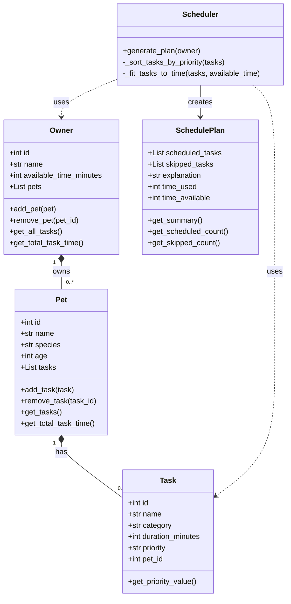

# PawPal+ UML Class Diagram

## Mermaid Diagram

## Class Details

### Owner (Dataclass)
- **Attributes:**
  - `id: int` - Unique identifier
  - `name: str` - Owner's name
  - `available_time_minutes: int` - Daily time budget
  - `pets: List[Pet]` - All owned pets
- **Methods:**
  - `add_pet(pet)` - Add pet to collection
  - `remove_pet(pet_id)` - Remove pet by ID
  - `get_all_tasks()` - Aggregate tasks from all pets
  - `get_total_task_time()` - Sum all task durations

### Pet (Dataclass)
- **Attributes:**
  - `id: int` - Unique identifier
  - `name: str` - Pet name
  - `species: str` - Animal type
  - `age: int` - Age in years
  - `tasks: List[Task]` - Tasks for this pet
- **Methods:**
  - `add_task(task)` - Add task to pet
  - `remove_task(task_id)` - Remove task by ID
  - `get_tasks()` - Return all tasks
  - `get_total_task_time()` - Sum task durations

### Task (Dataclass)
- **Attributes:**
  - `id: int` - Unique identifier
  - `name: str` - Task name
  - `category: str` - Task type (Walk, Feeding, etc.)
  - `duration_minutes: int` - Time required
  - `priority: str` - "high", "medium", "low"
  - `pet_id: int` - Associated pet ID
- **Methods:**
  - `get_priority_value()` - Convert priority to int (3, 2, 1)

### Scheduler (Logic Class)
- **Methods:**
  - `generate_plan(owner)` - Create schedule from owner's data
  - `_sort_tasks_by_priority(tasks)` - Sort by priority (private)
  - `_fit_tasks_to_time(tasks, available_time)` - Greedy fit algorithm (private)

### SchedulePlan (Result Object)
- **Attributes:**
  - `scheduled_tasks: List[Task]` - Tasks that fit
  - `skipped_tasks: List[Task]` - Tasks that didn't fit
  - `explanation: str` - Why these tasks were chosen
  - `time_used: int` - Minutes scheduled
  - `time_available: int` - Owner's time budget
- **Methods:**
  - `get_summary()` - Formatted text summary
  - `get_scheduled_count()` - Count scheduled
  - `get_skipped_count()` - Count skipped

## Relationships

- **Owner → Pet** (Composition `*--`): Owner owns 0 or more pets
- **Pet → Task** (Composition `*--`): Pet has 0 or more tasks
- **Scheduler → Owner** (Dependency `..>`): Scheduler uses Owner data
- **Scheduler → Task** (Dependency `..>`): Scheduler uses Task data
- **Scheduler → SchedulePlan** (Association `-->`): Scheduler creates SchedulePlan

## Priority Mapping
- `"high"` → 3
- `"medium"` → 2
- `"low"` → 1

## Task Categories
- Walk
- Feeding
- Medication
- Grooming
- Enrichment
- Training
